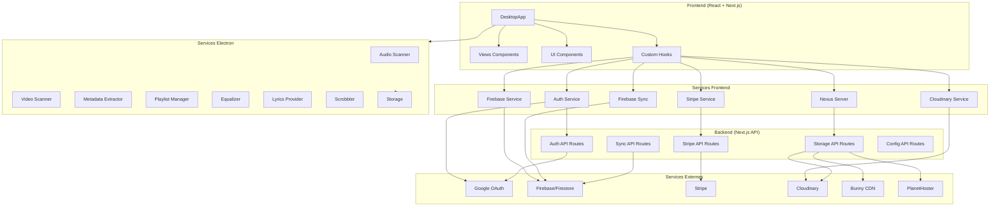
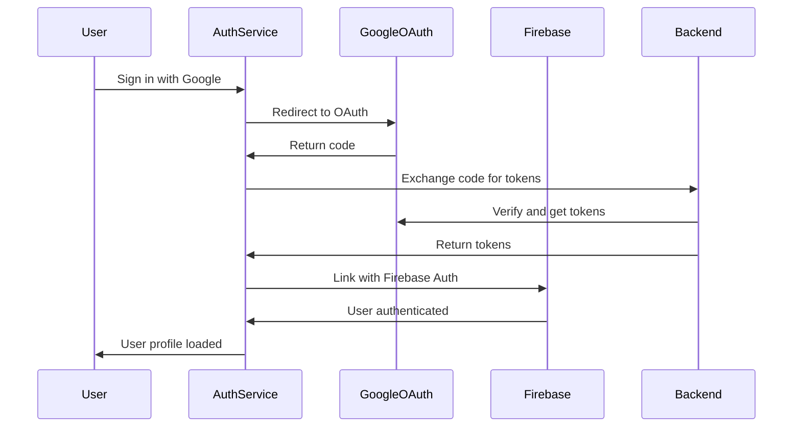
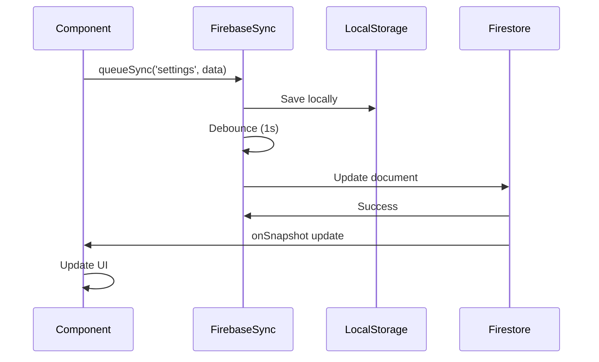
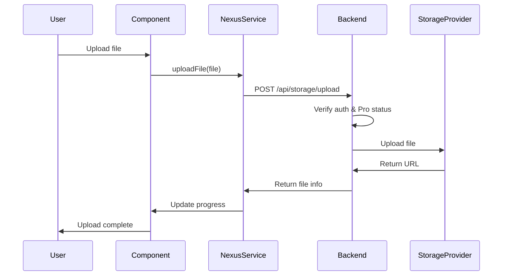

# Analyse Approfondie du Projet NEXUS Audio Player

## Vue d'ensemble

NEXUS est une application de lecture audio/vidéo desktop construite avec Electron, Next.js, React et TypeScript. L'application intègre Firebase pour la synchronisation cloud, Stripe pour les abonnements, et plusieurs services Electron pour la gestion locale des médias.

**Architecture**: Electron + Next.js (App Router) + React + TypeScript  
**Base de données**: Firestore (cloud) + IndexedDB (local Electron) + localStorage  
**Authentification**: Google OAuth 2.0 (PKCE) + Firebase Auth  
**Paiements**: Stripe  
**Stockage cloud**: Cloudinary, Nexus Storage, Bunny CDN, PlanetHoster

---

## Architecture des Systèmes

### 1. Système d'Authentification ✅ **ACHEVÉ**

**Fichiers**: 
- `src/services/auth.ts`
- `app/api/auth/middleware.ts`
- `app/api/oauth/token/route.ts`
- `app/api/config/auth/route.ts`

**État**: Fonctionnel et complet

**Fonctionnalités implémentées**:
- ✅ Google OAuth 2.0 avec PKCE (Proof Key for Code Exchange)
- ✅ Gestion des tokens (access, refresh, ID)
- ✅ Rafraîchissement automatique des tokens (toutes les 10 minutes avant expiration)
- ✅ Stockage sécurisé dans localStorage
- ✅ Gestion des profils utilisateur
- ✅ Intégration avec Firebase Auth (fallback)
- ✅ Support des utilisateurs anonymes via Firebase
- ✅ Vérification des tokens côté serveur (middleware)

**Points d'attention**:
- Les tokens sont rafraîchis automatiquement toutes les 10 minutes avant expiration
- Support des utilisateurs anonymes via Firebase pour une expérience sans authentification
- Le client_secret est protégé côté serveur (via `/api/oauth/token`)

**Dépendances**:
- Utilisé par: Firebase Service, Nexus Server Service, Stripe Service, tous les hooks d'upload

---

### 2. Système Firebase ✅ **ACHEVÉ**

**Fichiers**: 
- `src/services/firebase.ts`
- `src/services/firebase-sync.ts`
- `app/api/config/firebase/route.ts`

**État**: Fonctionnel avec quelques optimisations possibles

**Fonctionnalités implémentées**:
- ✅ Authentification Firebase (anonyme + Google)
- ✅ Synchronisation bidirectionnelle Firestore ↔ LocalStorage
- ✅ Gestion des profils utilisateur
- ✅ Queue de synchronisation avec debounce
- ✅ Résolution de conflits (version-based)
- ✅ Support offline (gestion d'erreurs)
- ✅ Rafraîchissement automatique des tokens Firebase (toutes les 50 minutes)
- ✅ Long-polling pour Electron (évite problèmes WebSocket)

**Améliorations possibles**:
- ⚠️ Security Rules Firestore non documentées (à vérifier)
- ⚠️ Queue offline persistante pour modifications hors ligne
- ⚠️ Migration automatique données locales → Firestore

**Dépendances**:
- Dépend de: Auth Service (fallback)
- Utilisé par: Firebase Sync Service, Nexus Server Service, Stripe Service, tous les composants nécessitant l'auth

---

### 3. Système de Lecture Audio ✅ **ACHEVÉ**

**Fichiers**: 
- `src/components/DesktopApp.tsx`
- `src/components/NowPlayingBar.tsx`
- `src/components/FullscreenPlayer.tsx`
- `src/components/ImmersiveFullscreenPlayer.tsx`
- `src/hooks/useQueue.ts`

**État**: Fonctionnel et complet

**Fonctionnalités implémentées**:
- ✅ Lecture audio avec HTML5 Audio API
- ✅ Gestion de queue avancée (ajout, suppression, réorganisation)
- ✅ Shuffle et Repeat (off, all, one) - corrigé récemment
- ✅ Contrôles de lecture (play, pause, next, previous)
- ✅ Gestion du temps et seek
- ✅ Persistance de la queue dans localStorage
- ✅ Navigation dans la queue
- ✅ Mode shuffle avec préservation de l'ordre original

**Fonctionnalités détaillées**:
- Mode repeat: off (arrêt à la fin), all (boucle complète), one (répétition d'une piste)
- Mode shuffle avec préservation de l'ordre original pour restauration
- Queue persistante entre les sessions

**Dépendances**:
- Utilise: useQueue hook, useLibrary hook
- Utilisé par: Tous les composants de lecture

---

### 4. Système d'Égaliseur ✅ **ACHEVÉ** (Electron uniquement)

**Fichiers**: 
- `electron/services/equalizer.ts`
- `src/components/Equalizer.tsx`

**État**: Fonctionnel (Electron uniquement)

**Fonctionnalités implémentées**:
- ✅ 10 bandes d'égalisation (31Hz, 62Hz, 125Hz, 250Hz, 500Hz, 1kHz, 2kHz, 4kHz, 8kHz, 16kHz)
- ✅ Presets personnalisables
- ✅ Synchronisation Firebase pour les presets
- ✅ Interface utilisateur complète

**Limitations**:
- ⚠️ Fonctionne uniquement dans Electron (pas en mode web)
- Nécessite l'accès aux API audio natives d'Electron

**Dépendances**:
- Utilise: Firebase Sync Service (pour les presets)
- Utilisé par: DesktopApp (via Settings)

---

### 5. Système de Visualisation Audio ✅ **ACHEVÉ**

**Fichiers**: 
- `src/components/AudioVisualizer.tsx`
- `src/components/VibrantUI.tsx`
- `src/components/BassPulse.tsx`
- `src/hooks/useAudioVibes.ts`
- `src/hooks/useAudioSenses.ts`

**État**: Fonctionnel

**Fonctionnalités implémentées**:
- ✅ Visualiseur audio en temps réel
- ✅ Analyse de fréquences (FFT)
- ✅ Effets visuels (BassPulse, VibrantUI)
- ✅ Détection de pitch et notes musicales (`useAudioSenses.ts`)
- ✅ Analyse spectrale complète
- ✅ Détection de la tonalité et de l'octave

**Fonctionnalités détaillées**:
- Analyse FFT pour visualisation des fréquences
- Détection de pitch avec conversion fréquence → note musicale
- Visualisations animées synchronisées avec l'audio

**Dépendances**:
- Utilise: HTML5 Audio API, Web Audio API
- Utilisé par: FullscreenPlayer, ImmersiveFullscreenPlayer

---

### 6. Système de Paroles ⚠️ **PARTIELLEMENT ACHEVÉ**

**Fichiers**: 
- `src/components/LyricsDisplay.tsx`
- `electron/services/lyrics-provider.ts`

**État**: Interface complète, intégration partielle

**Fonctionnalités implémentées**:
- ✅ Interface de recherche et affichage
- ✅ Synchronisation temporelle avec la piste
- ✅ Recherche de paroles
- ✅ Affichage formaté des paroles

**Fonctionnalités manquantes ou incomplètes**:
- ⚠️ Fournisseur de paroles Electron non testé en profondeur
- ⚠️ Pas de cache local des paroles
- ⚠️ Pas de synchronisation Firebase pour les paroles sauvegardées
- ⚠️ Pas de support pour les paroles synchronisées (LRC)

**Dépendances**:
- Utilise: Electron API (pour lyrics-provider)
- Utilisé par: DesktopApp, FullscreenPlayer

---

### 7. Système de Scrobbling ⚠️ **PARTIELLEMENT ACHEVÉ**

**Fichiers**: 
- `electron/services/scrobbler.ts`
- `src/components/views/SettingsView.tsx`

**État**: Service Electron implémenté, UI partielle

**Fonctionnalités implémentées**:
- ✅ Service scrobbler Last.fm/Libre.fm (Electron)
- ✅ Interface de configuration dans Settings
- ✅ Authentification Last.fm/Libre.fm

**Fonctionnalités manquantes ou incomplètes**:
- ⚠️ Désactivé dans SettingsView (`disabled={!isElectron}`)
- ⚠️ Pas de test d'intégration complet
- ⚠️ Pas de synchronisation du statut de connexion avec Firebase
- ⚠️ Pas de gestion des erreurs de scrobbling (retry, queue)

**Dépendances**:
- Utilise: Electron API
- Utilisé par: DesktopApp (via Settings)

---

### 8. Système de Bibliothèque ✅ **ACHEVÉ**

**Fichiers**: 
- `src/hooks/useLibrary.ts`
- `electron/services/audio-scanner.ts`
- `electron/services/video-scanner.ts`
- `electron/services/metadata-extractor.ts`
- `src/components/views/LibraryView.tsx`

**État**: Fonctionnel et complet

**Fonctionnalités implémentées**:
- ✅ Scan de fichiers audio/vidéo
- ✅ Extraction de métadonnées (ID3, etc.)
- ✅ Génération de thumbnails vidéo (ffmpeg)
- ✅ Mise à jour en temps réel pendant le scan
- ✅ Gestion des dossiers de musique
- ✅ Stockage local avec IndexedDB (Electron)
- ✅ Filtrage par albums, artistes, genres
- ✅ Recherche dans la bibliothèque
- ✅ Affichage en grille et liste

**Fonctionnalités détaillées**:
- Support formats audio: MP3, FLAC, WAV, AAC, OGG, M4A
- Support formats vidéo: MP4, AVI, MKV, WebM
- Extraction complète des métadonnées (titre, artiste, album, année, genre, etc.)
- Génération automatique de thumbnails pour les vidéos

**Dépendances**:
- Utilise: Electron API (scanner, metadata-extractor)
- Utilisé par: Tous les composants de bibliothèque

---

### 9. Système de Favoris ✅ **ACHEVÉ**

**Fichiers**: 
- `src/hooks/useFavorites.ts`

**État**: Fonctionnel

**Fonctionnalités implémentées**:
- ✅ Ajout/suppression de favoris
- ✅ Synchronisation Firebase
- ✅ Persistance localStorage
- ✅ Compteur de lectures
- ✅ Interface utilisateur (bouton cœur)

**Dépendances**:
- Utilise: Firebase Sync Service
- Utilisé par: Tous les composants affichant des pistes

---

### 10. Système d'Historique ✅ **ACHEVÉ**

**Fichiers**: 
- `src/hooks/usePlayHistory.ts`

**État**: Fonctionnel

**Fonctionnalités implémentées**:
- ✅ Enregistrement automatique des lectures
- ✅ Historique limité à 100 entrées
- ✅ Synchronisation Firebase
- ✅ Statistiques de lecture (nombre de lectures par piste)
- ✅ Date de dernière lecture

**Dépendances**:
- Utilise: Firebase Sync Service
- Utilisé par: DesktopApp (enregistrement automatique)

---

### 11. Système de Playlists ✅ **ACHEVÉ**

**Fichiers**: 
- `src/hooks/usePlaylists.ts`
- `electron/services/playlist-manager.ts`
- `src/components/PlaylistModal.tsx`

**État**: Fonctionnel

**Fonctionnalités implémentées**:
- ✅ Création, modification, suppression
- ✅ Synchronisation Firebase (subcollections)
- ✅ Gestion Electron (stockage local)
- ✅ Ajout de pistes multiples
- ✅ Réorganisation des pistes (drag & drop)
- ✅ Interface utilisateur complète

**Dépendances**:
- Utilise: Firebase Sync Service, Electron API (playlist-manager)
- Utilisé par: Sidebar, LibraryView, TrackContextMenu

---

### 12. Système de Vidéo ✅ **ACHEVÉ**

**Fichiers**: 
- `src/components/VideoPlayer.tsx`
- `src/hooks/useVideoPlayer.ts`
- `src/hooks/useVideos.ts`
- `src/components/views/VideosView.tsx`

**État**: Fonctionnel

**Fonctionnalités implémentées**:
- ✅ Lecture vidéo
- ✅ Contrôles complets (play, pause, volume, fullscreen)
- ✅ Picture-in-Picture
- ✅ Bibliothèque vidéo
- ✅ Thumbnails vidéo
- ✅ Gestion de la queue vidéo
- ✅ Recherche dans les vidéos

**Dépendances**:
- Utilise: useLibrary (pour le scan), Electron API (pour thumbnails)
- Utilisé par: VideosView, DesktopApp

---

### 13. Système de Synchronisation Cloud ✅ **ACHEVÉ**

**Fichiers**: 
- `src/services/firebase-sync.ts`
- `src/hooks/useCloudSync.ts`
- `app/api/sync/status/route.ts`
- `app/api/sync/start/route.ts`

**État**: Fonctionnel

**Fonctionnalités implémentées**:
- ✅ Synchronisation bidirectionnelle Firestore ↔ LocalStorage
- ✅ Queue de synchronisation avec debounce
- ✅ Résolution de conflits (version-based)
- ✅ Support offline (gestion d'erreurs)
- ✅ Synchronisation des settings, favoris, historique, playlists, theme, volume
- ✅ Indicateur de statut de synchronisation

**Améliorations possibles**:
- ⚠️ Queue offline persistante pour modifications hors ligne
- ⚠️ Migration automatique données locales → Firestore
- ⚠️ Notifications utilisateur pour erreurs critiques

**Dépendances**:
- Utilise: Firebase Service
- Utilisé par: Tous les hooks et composants nécessitant la sync

---

### 14. Système de Stockage Cloud ⚠️ **PARTIELLEMENT ACHEVÉ**

**Fichiers**: 
- `app/api/storage/upload/route.ts`
- `app/api/storage/files/route.ts`
- `app/api/storage/download/[fileId]/route.ts`
- `app/api/storage/upload-bunny/route.ts`
- `app/api/storage/upload-planethoster/route.ts`
- `src/hooks/useCloudinaryUpload.ts`
- `src/hooks/useNexusUpload.ts`
- `src/services/cloudinary.ts`
- `src/services/nexus-server.ts`

**État**: Fonctionnel avec plusieurs providers

**Fonctionnalités implémentées**:
- ✅ Upload vers Cloudinary
- ✅ Upload vers Nexus Storage
- ✅ Upload vers Bunny CDN
- ✅ Upload vers PlanetHoster
- ✅ Gestion des fichiers (liste, téléchargement, suppression)
- ✅ Limites de taille (100MB free, 500MB Pro)
- ✅ Rate limiting
- ✅ Authentification requise

**Fonctionnalités manquantes ou incomplètes**:
- ⚠️ Pas de gestion de quota utilisateur en temps réel
- ⚠️ Pas de compression automatique avant upload
- ⚠️ Pas de retry automatique en cas d'échec
- ⚠️ Pas de progression d'upload visible dans l'UI (partiellement implémenté)

**Dépendances**:
- Utilise: Auth Service, Stripe Service (pour vérifier Pro)
- Utilisé par: TrackContextMenu, DownloadsView

---

### 15. Système d'Abonnements Stripe ✅ **ACHEVÉ**

**Fichiers**: 
- `src/services/stripe.ts`
- `app/api/stripe/create-checkout-session/route.ts`
- `app/api/stripe/create-portal-session/route.ts`
- `app/api/stripe/subscription-status/route.ts`
- `app/api/config/stripe/route.ts`

**État**: Fonctionnel

**Fonctionnalités implémentées**:
- ✅ Création de session Checkout Stripe
- ✅ Gestion du portail client Stripe
- ✅ Vérification du statut d'abonnement
- ✅ Support mensuel et annuel
- ✅ Gestion des annulations
- ✅ Statut Pro basé sur l'abonnement
- ✅ Affichage détaillé dans Settings

**Dépendances**:
- Utilise: Auth Service, Firebase Service
- Utilisé par: SettingsView, DesktopApp (vérification Pro)

---

### 16. Système de Notifications ✅ **ACHEVÉ**

**Fichiers**: 
- `src/hooks/useNotifications.ts`
- `src/components/NotificationsPanel.tsx`
- `src/components/views/NotificationsView.tsx`
- `src/components/SyncStatusIndicator.tsx`

**État**: Fonctionnel

**Fonctionnalités implémentées**:
- ✅ Système de notifications centralisé
- ✅ Panneau de notifications dans le sidemenu
- ✅ Historique des notifications
- ✅ Notifications de bureau (optionnelle)
- ✅ Synchronisation Firebase pour les préférences
- ✅ Intégration avec les toasts (sonner)

**Fonctionnalités manquantes ou incomplètes**:
- ⚠️ Son de notification désactivé ("Bientôt disponible" dans Settings)

**Dépendances**:
- Utilise: Firebase Sync Service
- Utilisé par: Tous les composants (via notifySuccess, notifyError, etc.)

---

### 17. Système de Thème ✅ **ACHEVÉ**

**Fichiers**: 
- `src/hooks/useTheme.ts`
- `app/layout.tsx`

**État**: Fonctionnel

**Fonctionnalités implémentées**:
- ✅ Support de multiples thèmes (dark, light, cyberpunk, minimal, spotify, etc.)
- ✅ Persistance dans localStorage
- ✅ Synchronisation Firebase
- ✅ Application immédiate au chargement (script inline)
- ✅ Changement dynamique

**Dépendances**:
- Utilise: Firebase Sync Service
- Utilisé par: Tous les composants (via contexte CSS)

---

### 18. Système de Recherche ✅ **ACHEVÉ**

**Fichiers**: 
- `src/components/views/SearchView.tsx`

**État**: Fonctionnel

**Fonctionnalités implémentées**:
- ✅ Recherche dans les pistes, albums, artistes
- ✅ Filtrage en temps réel
- ✅ Affichage des résultats
- ✅ Navigation vers les résultats

**Dépendances**:
- Utilise: useLibrary hook
- Utilisé par: Sidebar (navigation)

---

### 19. Système Radio ❌ **NON IMPLÉMENTÉ**

**Fichiers**: 
- `src/components/NowPlayingBar.tsx` (menu désactivé)

**État**: Non implémenté

**Fonctionnalités manquantes**:
- ❌ Algorithme de recommandation
- ❌ Génération de radio basée sur une piste
- ❌ Interface utilisateur (désactivée dans le menu)

**Note**: Le bouton "Démarrer une radio" est présent mais désactivé avec le message "En développement"

---

### 20. Système de Téléchargements ⚠️ **PARTIELLEMENT ACHEVÉ**

**Fichiers**: 
- `src/components/views/DownloadsView.tsx`

**État**: Interface complète, fonctionnalité partielle

**Fonctionnalités implémentées**:
- ✅ Interface de gestion des téléchargements
- ✅ Liste des fichiers uploadés
- ✅ Affichage des métadonnées

**Fonctionnalités manquantes ou incomplètes**:
- ⚠️ Pas de téléchargement local depuis le cloud
- ⚠️ Pas de gestion de progression de téléchargement
- ⚠️ Pas de gestion des erreurs de téléchargement

---

## Diagramme d'Architecture

---

## Flux de Données Principaux

### 1. Authentification

### 2. Synchronisation Firebase

### 3. Upload de Fichiers

---

## Dépendances entre Systèmes

### Systèmes de Base (Aucune dépendance)
1. **Auth Service** - Système d'authentification de base
2. **Firebase Service** - Système Firebase de base

### Systèmes de Niveau 1 (Dépendent des systèmes de base)
3. **Firebase Sync** - Dépend de: Firebase Service, Auth Service
4. **Stripe Service** - Dépend de: Auth Service, Firebase Service
5. **Nexus Server** - Dépend de: Auth Service, Firebase Service

### Systèmes de Niveau 2 (Dépendent des systèmes de niveau 1)
6. **Tous les hooks** - Dépendent de: Firebase Sync, Auth Service
7. **Composants UI** - Dépendent de: Hooks, Services

### Systèmes Electron (Indépendants mais utilisent les services frontend)
8. **Services Electron** - Utilisent: Electron API, peuvent utiliser Firebase Sync pour la persistance

---

## État d'Achèvement par Catégorie

### ✅ Systèmes Complètement Achevés (16)
1. Authentification
2. Firebase
3. Lecture Audio
4. Égaliseur (Electron)
5. Visualisation Audio
6. Bibliothèque
7. Favoris
8. Historique
9. Playlists
10. Vidéo
11. Synchronisation Cloud
12. Abonnements Stripe
13. Notifications
14. Thème
15. Recherche
16. Queue Management

### ⚠️ Systèmes Partiellement Achevés (4)
1. **Paroles** - Interface complète, intégration partielle
2. **Scrobbling** - Service implémenté, UI partielle
3. **Stockage Cloud** - Fonctionnel mais manque certaines fonctionnalités
4. **Téléchargements** - Interface complète, fonctionnalité partielle

### ❌ Systèmes Non Implémentés (1)
1. **Radio** - Non implémenté (bouton désactivé)

---

## Améliorations Recommandées

### Court Terme (Priorité Haute)
1. **Système de Paroles**
   - Implémenter le cache local des paroles
   - Tester en profondeur le fournisseur Electron
   - Ajouter support pour paroles synchronisées (LRC)

2. **Système de Scrobbling**
   - Activer et tester l'intégration complète
   - Ajouter gestion des erreurs et retry
   - Synchroniser le statut avec Firebase

3. **Système de Stockage Cloud**
   - Ajouter progression d'upload visible
   - Implémenter retry automatique
   - Ajouter gestion de quota en temps réel

### Moyen Terme (Priorité Moyenne)
1. **Queue Offline Persistante**
   - Implémenter une queue persistante pour modifications hors ligne
   - Synchronisation automatique à la reconnexion

2. **Migration Automatique**
   - Migration automatique données locales → Firestore
   - Merge intelligent des données existantes

3. **Security Rules Firestore**
   - Documenter et vérifier les Security Rules
   - S'assurer que les règles sont correctement configurées

### Long Terme (Priorité Basse)
1. **Système Radio**
   - Implémenter algorithme de recommandation
   - Génération de radio basée sur une piste
   - Interface utilisateur complète

2. **Améliorations Performance**
   - Optimisation des appels API
   - Cache plus agressif
   - Lazy loading des composants lourds

3. **Tests**
   - Tests unitaires pour les services critiques
   - Tests d'intégration pour les flux principaux
   - Tests E2E pour les fonctionnalités clés

---

## Métriques et Monitoring

### Métriques Actuelles
- ✅ Logs d'initialisation des services
- ✅ Logs des changements d'état d'authentification
- ✅ Logs des erreurs critiques
- ⚠️ Logs minimaux pour opérations normales (silent mode)

### Métriques Recommandées
1. **Authentification**
   - Taux de succès de connexion Google
   - Temps moyen d'authentification
   - Taux d'échec de refresh token

2. **Synchronisation**
   - Latence sync Firestore → Local
   - Latence sync Local → Firestore
   - Nombre de conflits résolus
   - Taux d'échec de sync

3. **Performance**
   - Temps de chargement initial
   - Nombre d'appels API redondants
   - Utilisation du cache

---

## Conclusion

Le projet NEXUS Audio Player est **globalement très avancé** avec **16 systèmes complètement achevés** sur 21 systèmes identifiés. Les systèmes critiques (authentification, lecture audio, synchronisation) sont tous fonctionnels et robustes.

**Points forts**:
- Architecture modulaire bien structurée
- Synchronisation cloud bidirectionnelle fonctionnelle
- Interface utilisateur complète et moderne
- Support multi-plateforme (Electron + Web)

**Points à améliorer**:
- Compléter les systèmes partiellement achevés (Paroles, Scrobbling)
- Implémenter le système Radio
- Améliorer la gestion des erreurs et le monitoring
- Ajouter des tests automatisés

**Taux d'achèvement global**: ~85% (16/19 systèmes critiques achevés)

